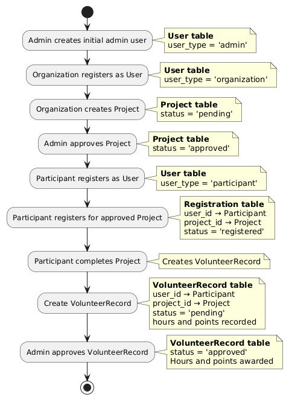
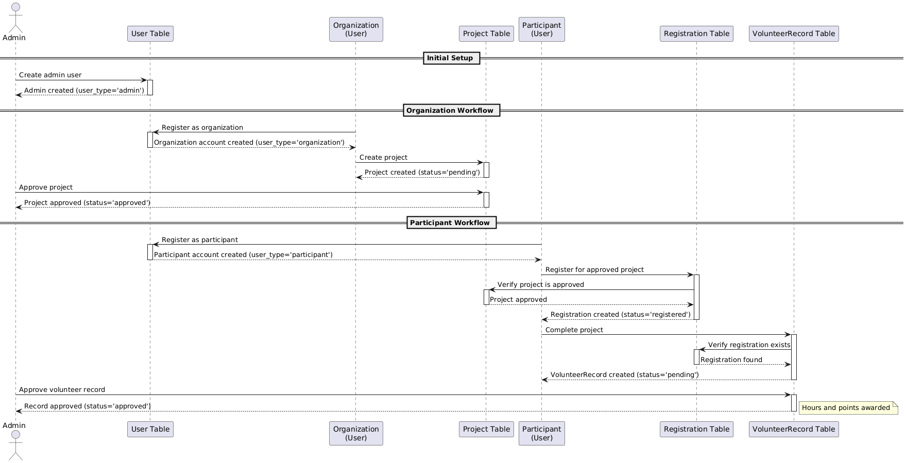

# Sustainable Volunteer Service Platform

> Connect volunteers with organizations to advance sustainable development.

- **Demo video**: [Milestone 2 Demo (Bilibili)](https://www.bilibili.com/video/BV1NzUrBmEht/?spm_id_from=333.1387.list.card_archive.click&vd_source=e6f58c2316bd6fa41e2146ddd9513a79)
- **Diagrams / screenshots**: see [Screenshots & Diagrams](#screenshots--diagrams).

---

## Table of Contents
1. [Author](#author)
2. [Features](#features)
3. [Tech Stack](#tech-stack)
4. [Quick Start](#quick-start)
5. [Security Notes](#security-notes)
6. [Screenshots & Diagrams](#screenshots--diagrams)
7. [Project Structure](#project-structure)
8. [Key Pages](#key-pages)
9. [Database Models](#database-models)
10. [License](#license)

---

## Author
- **Project Author**: Yanxiang Ao, Haoming Xi, Honghao Liu  
- **Course / Year**: 2024-2025  
- This project is original work; external libraries are listed in `requirements.txt`.

---

## Features
- Three roles: **Participant / Organization / Admin**
- Project lifecycle: create → review → approve → register → complete
- Sustainability rating (0–5 stars) with color-coded badges
- Volunteer hours & points tracking; gamified badges/milestones
- Dark/Light themes + role-based accent colors; customizable backgrounds
- Responsive layout (desktop/tablet)

---

## Tech Stack
- **Frontend**: HTML5, CSS3, Vanilla JS
- **Backend**: Flask (Python)
- **Database**: SQLite + SQLAlchemy
- **Validation**: WTForms (auth) + Marshmallow (project APIs)

---

## Quick Start
```bash
# 1) Install deps
pip install -r requirements.txt

# 2) Set env (PowerShell example)
$env:SECRET_KEY="dev-secret"
$env:ADMIN_USERNAME="admin"
$env:ADMIN_EMAIL="admin@example.com"
$env:ADMIN_PASSWORD="admin123"

# 3) Run
set FLASK_APP=app.py & set FLASK_ENV=development & flask run
# or
python app.py

# 4) Open
# http://localhost:5000
```

---

## Demo Accounts (for testing only)

These mock accounts are seeded automatically for local development and demo:

- **Admin**
  - Username: `admin`
  - Email: `admin@example.com`
  - Password: `admin123`  *(or your `ADMIN_PASSWORD` env var if changed)*
- **Organization**
  - Username: `greenearth`
  - Email: `contact@greenearth.org`
  - Password: `OrgPass123!`
- **Participant**
  - Username: `emma`
  - Email: `emma@example.com`
  - Password: `Volunteer123!`

> Do **not** reuse these passwords in production. In real deployments, set strong unique credentials via environment variables.

---

## Security Notes
- Production: set `SECRET_KEY`, `ADMIN_PASSWORD`, `DATABASE_URL`, `LOG_FILE`, `LOG_LEVEL`.
- Admin password is never hardcoded; missing passwords are warned in logs (dev only).
- Keep real secrets out of version control; use env vars.

---

## Screenshots & Diagrams
- Database schema  
  
- Data flow (activity)  
  
- Data flow (sequence)  
  
- Demo video (online)  
  [Milestone 2 Demo (Bilibili)](https://www.bilibili.com/video/BV1NzUrBmEht/?spm_id_from=333.1387.list.card_archive.click&vd_source=e6f58c2316bd6fa41e2146ddd9513a79)

---

## Project Structure (key files)
```
app.py                # App factory, logging, seeds admin
config.py             # Env-driven config (SECRET_KEY, DB URL, logging)
models.py             # SQLAlchemy models
schemas.py            # Marshmallow validation for projects
forms.py              # WTForms for login/register
api/                  # Flask blueprints (projects, users, registrations, etc.)
templates/            # HTML pages (home, dashboards, admin, detail, records)
static/css/           # base/components/layout/pages/dark-theme
static/js/            # modal, theme, auth, dashboards
docs/images/          # Diagrams & screenshots
docs/video/           # Demo video
```

---

## Key Pages
1. **Home** (`index.html`) — intro, stats, featured projects (loaded by `home.js`)
2. **Login/Register** (`login.html`) — combined auth card, WTForms validation
3. **Participant Dashboard** (`participant_dashboard.html`) — stats, badges, registrations, records
4. **Organization Dashboard** (`organization_dashboard.html`) — publish/manage projects, registrations
5. **Admin Panel** (`admin_panel.html`) — project review, hour review, user management, logs
6. **Project Detail** (`project_detail.html`) — full project info, registration, comments
7. **Volunteer Record** (`volunteer_record.html`) — hour/points table with filters & export

---

## Database Models (summary)
- **User** — participants / organizations / admins (unique username & email)
- **Project** — owned by organization; lifecycle statuses; min/max participants; rating/points
- **Registration** — participant ↔ project; status `registered/approved/cancelled/rejected/completed`
- **VolunteerRecord** — certified hours & points; status `pending/approved`

---

## License
MIT License — free for educational or commercial use.
