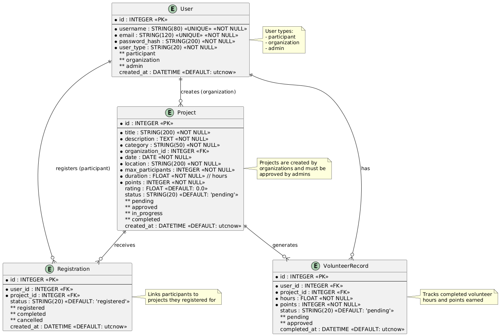

# Sustainable Volunteer Service Platform

A web application connecting volunteers with organizations to practice sustainable development goals.

## Features

- **Three User Types**: Participants, Organizations, and Administrators
- **Project Management**: Create, browse, and register for volunteer projects
- **Sustainability Rating**: 0-5 star rating system with color-coded badges
- **Volunteer Hours Tracking**: Track and certify volunteer hours
- **Points & Badges System**: Earn points and achievement badges
- **Responsive Design**: Works on desktop and tablet devices

## Technology Stack

- **Frontend**: HTML5, CSS3, JavaScript (Vanilla)
- **Backend**: Flask (Python)
- **Database**: SQLite
- **Design**: Green eco-friendly theme with 8px border radius

## Installation

1. Install Python dependencies:
```bash
pip install -r requirements.txt
```

2. Run the Flask application:
```bash
# Option A: using Flask CLI
set FLASK_APP=app.py & set FLASK_ENV=development & flask run

# Option B: run directly
python app.py
```

3. Open your browser and navigate to:
```
http://localhost:5000
```

## Default Admin Credentials

- Username: `admin`
- Password: `admin123`
- User Type: Administrator

**⚠️ Important: Change the default admin password after first login!**

## Project Structure

```
/
├── app.py                      # App factory, registers blueprints, seeds admin
├── config.py                   # Configuration (secret key, DB URI, etc.)
├── models.py                   # SQLAlchemy models and db instance
├── routes.py                   # All Flask routes (Blueprint 'main')
├── forms.py                    # Minimal form parsers for login/register
├── requirements.txt            # Python dependencies
├── README.md                   # Project documentation
├── instance/                   # Instance folder (Flask convention)
│   └── volunteer.db           # SQLite database (auto-created)
├── templates/                  # HTML templates
│   ├── index.html             # Home page
│   ├── login.html             # Login/Register page
│   ├── participant_dashboard.html
│   ├── organization_dashboard.html
│   ├── admin_panel.html
│   ├── project_detail.html
│   └── volunteer_record.html
└── static/                     # Static files
    ├── css/
    │   └── style.css          # Main stylesheet
    └── js/
        ├── home.js
        ├── auth.js
        └── participant.js
```

## Pages

1. **Home Page** - Platform introduction, statistics, featured projects
2. **Login/Register** - User authentication with role selection
3. **Participant Dashboard** - Personal stats, badges, projects
4. **Organization Dashboard** - Create and manage projects
5. **Admin Panel** - Approve projects and volunteer hours
6. **Project Detail** - Complete project information and registration
7. **Volunteer Record** - Hour tracking with filtering and export

## Database Models

- **User**: Stores user accounts (participants, organizations, admins)
- **Project**: Volunteer project information
- **Registration**: Project registrations by participants
- **VolunteerRecord**: Certified volunteer hours and points

### Database Schema Diagram



This Entity-Relationship (ER) diagram illustrates the complete database structure with four main tables:

- **User Table**: Central entity storing all user accounts with three types (participant, organization, admin). Each user has unique username and email, encrypted password, and timestamp of account creation.

- **Project Table**: Created by organizations (`organization_id` foreign key), projects contain volunteer activity details including location, date, maximum participants, duration, points, and sustainability rating. Projects go through status lifecycle: `pending` → `approved` → `in_progress` → `completed`.

- **Registration Table**: Junction table connecting participants to projects. Tracks registration status (`registered`, `completed`, `cancelled`) and creates the many-to-many relationship between users (participants) and projects.

- **VolunteerRecord Table**: Records completed volunteer work with hours and points earned. Each record links a participant to a specific project and tracks approval status (`pending` → `approved`) by administrators.

**Key Relationships:**
- One organization can create many projects (1:N via `organization_id`)
- One participant can register for many projects (1:N via `Registration.user_id`)
- One project can have many registrations (1:N via `Registration.project_id`)
- One participant can have many volunteer records (1:N via `VolunteerRecord.user_id`)
- One project can generate many volunteer records (1:N via `VolunteerRecord.project_id`)

### Data Population Flow

**Activity Diagram:**


This activity diagram shows the step-by-step workflow of how data flows through the system:

1. **Initial Setup**: An administrator creates the first admin user account in the system
2. **Organization Registration**: Organizations register as users with `user_type='organization'`
3. **Project Creation**: Organizations create volunteer projects, which start with `status='pending'`
4. **Project Approval**: Administrators review and approve projects, changing status to `approved`
5. **Participant Registration**: Volunteers register as users with `user_type='participant'`
6. **Project Registration**: Participants register for approved projects, creating a `Registration` record with `status='registered'`
7. **Project Completion**: After completing volunteer work, a `VolunteerRecord` is created with `status='pending'`, including hours worked and points earned
8. **Record Approval**: Administrators verify and approve volunteer records, changing status to `approved`, which officially awards the hours and points to the participant

The diagram illustrates the complete lifecycle from user registration to volunteer hour certification, showing how different user roles interact with the database at each stage.

**Sequence Diagram:**


This sequence diagram provides a detailed view of the interactions between system actors and database tables during the data population process:

- **Initial Setup Phase**: Shows how the admin creates the first admin user directly in the User table
- **Organization Workflow**: Demonstrates the sequence where organizations register, create projects, and wait for admin approval before projects become available
- **Participant Workflow**: Illustrates how participants register, search for approved projects, create registration records, complete volunteer work, and finally receive approval for their volunteer hours

The sequence diagram emphasizes the verification steps (e.g., checking if a project is approved before registration, verifying registration exists before creating volunteer records) and shows the communication flow between different system components. This helps understand the data integrity checks and approval workflows that ensure only valid data enters the system.

## API Endpoints

- `GET /api/projects` - List all approved projects
- `POST /api/register-project` - Register for a project

## Customization

### Change Color Theme

Edit `/static/css/style.css` and modify the CSS variables:
```css
:root {
  --primary-green: #16a34a;
  --secondary-blue: #3b82f6;
  /* ... other variables */
}
```

### Change Secret Key

Edit `app.py` and change the secret key:
```python
app.config['SECRET_KEY'] = 'your-new-secret-key'
```

## License

MIT License - feel free to use this project for educational or commercial purposes.

## Support

For issues or questions, please open an issue on the project repository.
